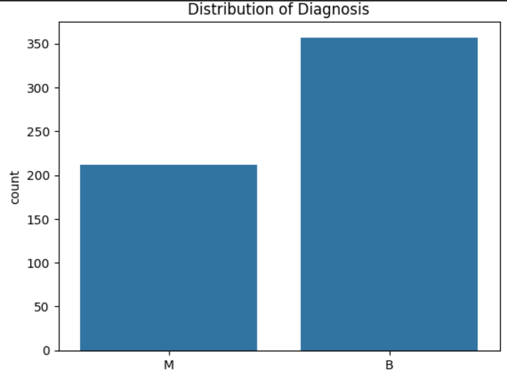
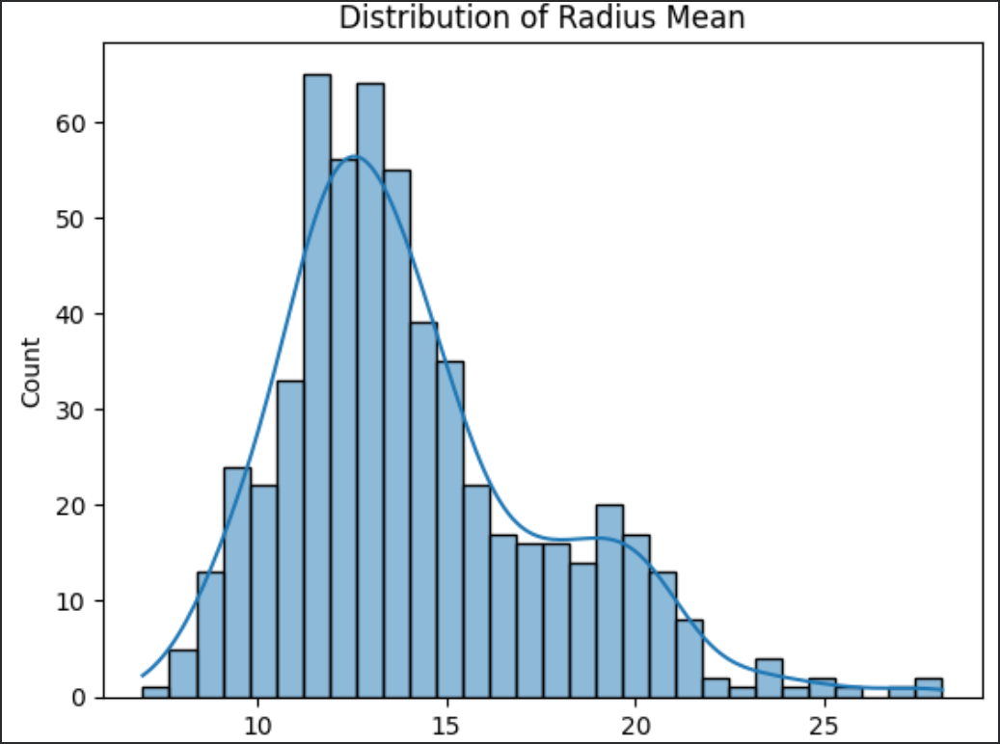
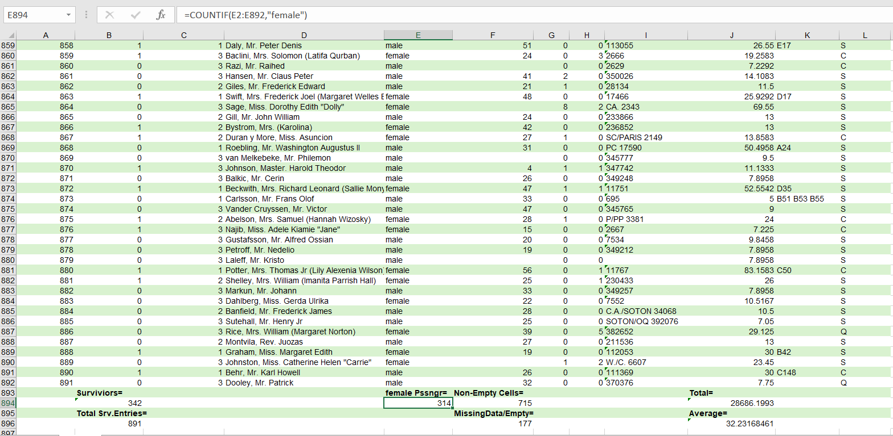

# Career Launchpad Phase II – Week 1 Tasks

---

##  Task 1 – Breast Cancer Dataset (Python/Colab)

### Overview
Analysis of the Breast Cancer Wisconsin dataset using Python (Colab). Workflow included data cleaning, preprocessing, exploratory data analysis, and visualization.

### Key Steps
- Imported dataset into Pandas DataFrame.  
- Handled missing values and duplicates.  
- Generated descriptive statistics and group comparisons.  
- Performed correlation analysis
- Visualized diagnosis distribution and feature histograms.  

### Visualizations
- Diagnosis Distribution (Bar Chart)  
  

- Feature Distribution (Histogram)  
  

---

## Task 2 – Titanic Dataset (Excel/Google Sheets)

### Overview
Spreadsheet analysis of the Titanic dataset using Excel (Power Query) and Google Sheets formulas.

### Functions Applied
- **COUNT / COUNTA / COUNTIF** → survival counts, gender distribution, missing ages, unique ticket classes.  
- **COUNTBLANK** → identified missing ages.    
- **SUM** → total fares.  
- **AVERAGE** → average age and fare.  

### Key Insights
- Majority of passengers were male.  
- Survival rate was higher among females and first-class passengers.  
- Average passenger age ≈ 29 years, average fare ≈ 32 units.  
- Missing values in Age column identified using `COUNTBLANK`.

### Output

- Output and calculatios via Formulas  
  
  
---
## 📂 Datasets
- **Breast Cancer Wisconsin (Diagnostic) Dataset**  
  Source: [Kaggle](https://www.kaggle.com/datasets/uciml/breast-cancer-wisconsin-data)  
  Used in Task 1 for Python analysis (Colab).

- **Titanic Dataset**  
  Source: [Kaggle](https://www.kaggle.com/c/titanic/data)  
  Loaded directly from the web in Task 2 for Excel/Google Sheets analysis.

 ---

## Summary
Task 1 (Breast Cancer dataset) highlighted differences between malignant and benign cases using Python analysis.  
Task 2 (Titanic dataset) revealed demographic and survival patterns using spreadsheet formulas (COUNT, SUM, AVERAGE).  

Together, these tasks demonstrate a **multi-tool approach to data analysis**:  
- Python for advanced statistical exploration.  
- Excel for structured cleaning and automation.  
- Google Sheets for quick, formula-based analysis.  

---

##  How to Use
1. Clone the repository.  
2. Open `Task1_BreastCancer.ipynb` in Google Colab for Python analysis.  
3. Open `Task2_Titanic.xlsx` in Excel or Google Sheets to view spreadsheet formulas.  
4. Refer to `Task_Report.docx` for detailed explanations and screenshots.  

---

## Author
**Maham Arif**  
Department of Computer Science, UET Mardan  

